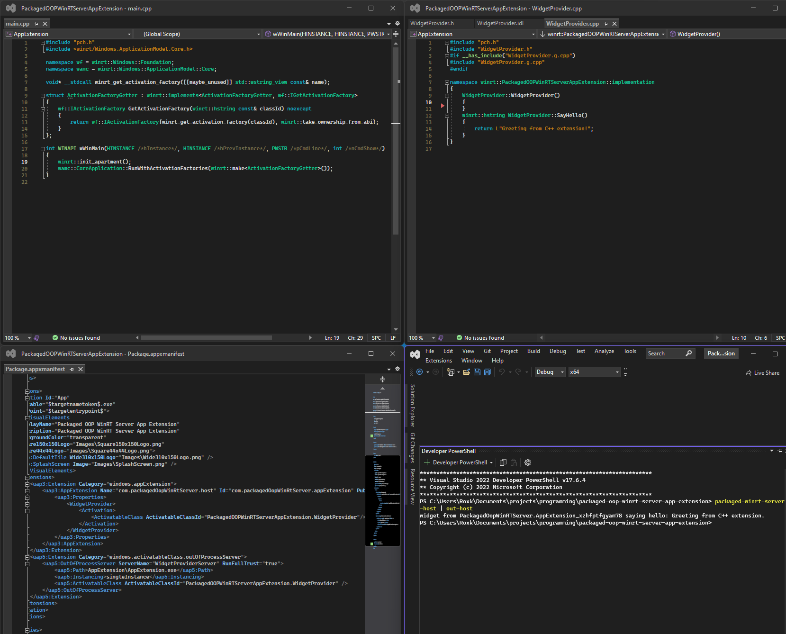
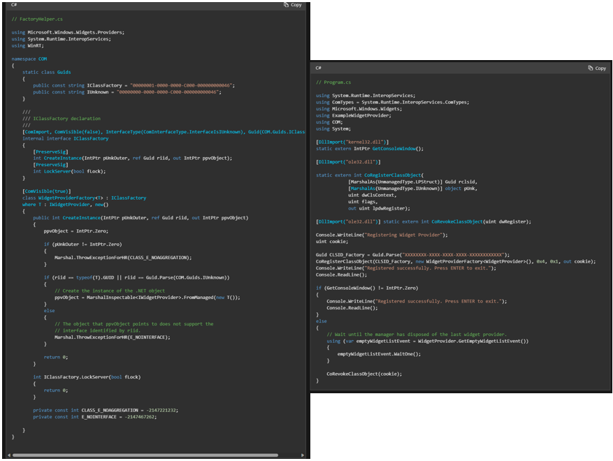
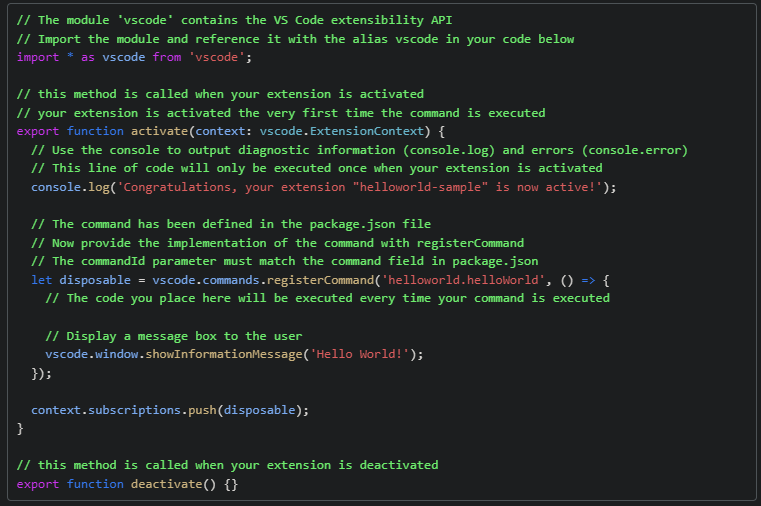

# Packaged OOP WinRT Server Sample

## Goodbye COM Server, Hello WinRT Server

COM Server was great. But WinRT Server is even better. It's time to say good bye to manually writing GUID, `ComExport`, proxy stub, `CoRegisterClassObject` and whatever else is needed to write COM IPC. Anything COM server can do, WinRT server can do as well, with fewer boilerplate, and less room for errors. In 2023, it's time to say good bye to COM Server and actively adopt its successor.

## What?

This is a sample that demonstrates how to use packaged OOP (Out-Of-Process) WinRT Server and Dynamic Dependency to implement IPC/customization point, replacing packaged COM server.

The following samples are available:
- Using packaged OOP WinRT Server with MSIX App Extension (aka Widget/Dev Home-like API)

## Motivation

Both [Widget Board](https://learn.microsoft.com/en-us/windows/apps/develop/widgets/implement-widget-provider-cs) and [Dev Home](https://github.com/microsoft/devhome/blob/main/docs/extensions.md), new hero features of windows 11, use COM Server to implement their extensibility API.

Widget's documentation has two huge blocks of COM boilerplate just to define the class factory and register the class factory. The image below shows the two code blocks side by side. This developer experience is not acceptable in 2023.

As a comparison, [Visual Studio Code Extension's entry point](https://code.visualstudio.com/api/get-started/extension-anatomy#extension-entry-file) is just a handful of js. Note, how _most of the code in the snippet below are comments_. Removing comments in the snippet and the LOC comparison would be very embarrassing for widget and similarly dev home's API.

(Both vs code extension and widget/dev home require some kind of manifest and that's omitted)

Fortunately, windows could do better. Enter WinRT Server.

## WinRT Server to The Rescue

WinRT Server is the next step of COM Server. Instead of CLSID based, WinRT Server use class name (activatable class ID) to instantiate class.

Instead of manually defining the class factory interface, implementing a class factory, registering the class factory, WinRT's built-in classes and projections (`CoreApplication` and generated `GetActivationFactory`) handle all of these for us.

With AppX Manifest supporting Out-Of-Process WinRT Server, we don't have to do anything, and the package would automatically broadcast to the system that a WinRT server is available. No more adding CLSID to registry and suffer from registry pollution/breakage (granted, pacakged COM server enjoys similar benefit).

The last bits of the puzzle comes from new features of Windows 11/WASDK. One of them is Dynamic Dependency. Packaged WinRT server is good, but due to binary lookup rules for class activation request handler, it only works when the client can locate the binary that handles the activation request.

If the packaged WinRT server comes from a known package, all a client has to do is to declare a dependency on the package. However, if the WinRT server comes from downstream packages - like in the case of widget or Dev Home - there is no trivial way to locate the binary which would handle the activation request even though an app had declared it in the manifest.

That is, until windows 11/WASDK's Dynamic Dependency. Dynamic Dependency allows client to dynamically register a package as dependency, adding it to the package graph, enabling the system to locate the packaged WinRT server binary.

The final bit that links everything together is the ability to add _any_ package via dynamic dependency. Previously, only framework package can be added via dynamic dependency, and only MS can release framework package on the store. `uap15:DependencyTarget`, added in Windows 11 22H2 (22621), enables _all_ apps to be added via dynamic dependency. That means apps that develop widget and Dev Home extensions are legible packages for dynamic dependency.

## Call for Action

If your app define any customization point/IPC via COM server, it's time to migrate to WinRT server. All the missing links have been completed in Windows 11 22H2.

I strongly recommend Widget Board and Dev Home adopts WinRT server as an customization point. It is up to the team to decide whether Windows 11 22H2 as the minimum supported version is acceptable (if not, keep COM server and add WinRT server as another customization point mechanism), _BUT_, developers who embrace the latest technology offering from MS deserve a better developer experience. The capability is here, we just need to _actively_ use it, embrace it, together. It's important for MS to be proactive in this space.

## FAQ

### You are just exaggerating. Boilerplate problem can be solved by template.

_Then provide it_. The first page of VS Code extension documentation is actually run a cli to generate the project and build it. With no modification necessary. Until that comes, boilerplate remains a valid criticism.

### So you are asking the team/app developers to update the API just to solve a problem that can be solved by template?

Yes. I'd argue even with template, the amount of boilerplate is not acceptable. 

Technically, the code blocks in widget's documentation can be copy and pasted. Modify the GUID a bit and you would be good to go. But it _requires_ devs to know about COM in the first place. Anedoctally, I have seen a dev [giving up on widget as soon as he sees COM](https://twitter.com/okazuki/status/1672457638691635200?t=lhFS0J82KZwwSi9f0Bwqjw&s=19)*, since he isn't familiar with it. COM is a huge barrier to entry. If MS want these techology (Widget/Dev Home) to thrive, they need to lower the barrier to entry, not lift it.

WinRT server is the perfect tool to lower the barrier to entry. The 5 lines of boilerplate in C# and C++ are all just class and methods. No GUID. No `ComImport`. No `DllImport`. No marshalling. No set event and cookie. _It's just plain class and methods_.

The best part? WinRT server's boilerplate doesn't require developers to change anything, at all. It's all just code generated from the projection. It would truly be a 1-time copy and paste. Should there be template, the template would be much easier to maintain.

I'd also touch on a less technical, but more social argument - COM is just old at this point. Using COM server doesn't make people think a technology as cool, new, exciting. It might be more associated with legacy, baggage, boring, boilerplate. WinRT server has none of those connotation and rightfully so.

(The fact that COM is the underlying technology of WinRT doesn't undermine the impression/boilerplate nature of it)

*Link authorized by tweet poster

### But WinRT server cannot implement my X/Y usecase whereas COM server could

This is a valid point. If you have any such use case that is not covered in this sample, please file an issue. I'd try to see what I can do.

Besides that, I'd urge the community to try to actively investigate whether that usecase is really impossible to implement, and if so please propose in WASDK repository or here about what could be changed to improve the situation. WinRT server is only as good as people pushing it to be. If you stick with COM, nothing improves. Everyone suffers in the long run.

If you read this far, you probably care about windows. Let's improve windows together.
